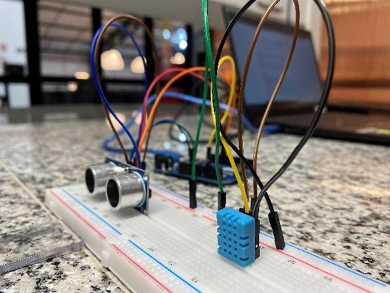

<h1 align="center"> Utilização de sensores hc-sr04 e qht11 para mensuração de espaço-tempo através do arduino </h1>
<h3 align="center"> Guilherme G. Dariani, Gustavo D. Verçosa, Shaian J. Anghinoni e Vitor E. G. Barelli.  
Ilum Escola de Ciência, CNPEM, Campinas - Brasil
</h3>
<h2 align = "center"> Resumo</h2>

O projeto compreende a proposta de grupos – com quatro alunos – elaborarem, em aula, a montagem de um setup que utiliza a placa Leonardo (para Arduino) como base e os sensores HC-SR04 e QHT11 para a apuração de grandezas físicas, além dos componentes adicionais (como cabos jumpers, protoboard etc.). Estima-se, então, a possibilidade de mensurar as medidas espaciais e temporais através do uso desses equipamentos e, posteriormente, a elaboração de um gráfico no qual será constatado o resultado: a variação da velocidade do som em decorrência da divergência de temperatura e de interferências ambientais.  Conclui-se, assim, que a temperatura está diretamente ligada à velocidade do som, considerando um sistema ideal de medição.
<h2 align = "center"> Introdução</h2>
 A aplicação estudada se baseará nos conceitos de ultrassonografia do sensor de medida de distância, o qual funciona através do emprego de ondas sonoras que são emitidas por uma fonte – nesse caso, o HC-SR04 – e, consecutivamente, recebidas (chamadas de echo). Dessa forma, por meio do software do Arduino, é possível calcular o tempo de resposta sobre o echo: assumindo que o som viaja a 1100 pés/segundo em temperatura ambiente, temos que as ondas sonoras elaboradas são t e o seu percurso é d, assim, d = 1100 × 12 × t polegadas e, como a distância da onda viaja duas vezes, isto é, da fonte ao objeto e vice-versa, então sua expressão final é dada por d/2 (SONI, A.&AMAM, A., 2018). 
 Por intermédio dessa prática, determinou-se o objetivo de conseguir ponderar a distância entre a fonte e o objeto, considerando a variação de temperatura e o estabelecimento prévio da distância (cerca de 20 centímetros) e, por fim, elaborar um gráfico que alude às estatísticas de variação obtidas pela média calculada em centímetros/segundo das mensurações feitas pelo protótipo. 
<h2 align = "center"> Metodologia</h2>
 Para a montagem do modelo foi utilizado: um Arduino Leonardo, uma protoboard, onze jumpers, um sensor de temperatura e umidade QHT11 e um sensor ultrassônico HC-SR04. A estruturação da base eletrônica foi realizada no software Arduino por meio da linguagem de programação C++. E a mensuração da distância pré-definida foi a partir de uma régua escolar de 30 centímetros, a qual, no fim do espaço, detém um notebook como objeto limite. 
 Inicialmente o protótipo foi desenvolvido no software Arduino em conjunto com a montagem eletrônica dos componentes usados. Em seguida, realizaram-se testes do funcionamento de todo o projeto e, a partir disso, adquirir a amostra dos dados (de temperatura e de velocidade do som). Assim, formatar gráficos por meio da análise computacional (no Excel) dessas informações: apresentando as suas respectivas médias e diferenças de maior e menor. 
 O sensor HC-SR04 é um dispositivo de medição ultrassônica, no qual há um circuito de controle, um transmissor e um receptor ultrassônico. Funciona com 5 V e deve receber, no mínimo, 10 µs (microssegundos) e realizar 8 ciclos de pulsos a 40 kHz, enquanto espera o sinal refletido – echo. O código da programação é apoiado em determinados argumentos: o high no pino echo; o delay que representará a distância até o objeto; o pulseIn que efetua a chamada e o digitalWrite que lê tal chamada. Assim, chega-se na distância em centímetros, segundo a equação: distância = (tempo em high × velocidade do som) /2 (NAKATANI, A. M. et. al. 2014). 
<h2 align = "center"></h2>

Figura 1: Circuito do Arduino mostrando o sensor HC-SR04 e o sensor DHT11, da esquerda para direita. Autoria própria.
<h2 align = "center"> Discussão</h2>
 Constatamos que a velocidade do som oscila conforme as alterações ambientais, sejam elas de temperatura ou de interferência externa. Em vista disso, na Sala 1, a qual houve significativas variações, observou-se que a frequência das conversas e o ar-condicionado desorganizaram os valores de velocidade do som – de média 351.50 m/s –, com alterações de 25.14 unidades (de 329.49 m/s a 354.61 m/s) em uma temperatura média de 24.35 °C (entre 24.10 °C e 24.50 °C). 
 Já na Sala 2 não houve interferências externas nem expressivas oscilações de temperatura (de 25.20 °C a 26.40 °C, com a média de 26.10 °C). Assim, a velocidade do som também alterou brevemente (entre 329.49 m/s e 354.61 m/s), obtendo, portanto, a média de 346.21 m/s. 
 Como alternativa, a Sala 3 foi uma nova medição da Sala 1, nesse caso, com menos intervenções. Entretanto, a temperatura oscilou pouco (entre 24.10 °C e 24.40 °C, com a média em 24.21 °C), entendeu-se, então, que a temperatura também varia com a agitação humana. E, por sua vez, a velocidade do som obteve, novamente, uma extensa inconstância com os mesmos limites: de 329.49 m/s a 354.61 m/s, mas tendo a média de 349.26 m/s. 
Por fim, na Sala 4 não teve considerável interferência externa e a sensação térmica era superior, em 25.21 °C – de 25.00 °C a 25.40 °C. E, assim, foram os menores valores de oscilação, a velocidade situou-se entre 373.48 m/s e 369.34 m/s, obtendo a média de 369.76 m/s. 
O seguinte gráfico faz referência aos valores de média apresentados de temperatura e de velocidade do som, dessa forma, os números 1 a 4 representam, respectivamente, da Sala 1 à Sala 4. Dessa forma, observa-se, então, na esquerda, os limites de velocidade em m/s e, na direita, os limites de temperatura em °C. 
 <h2 align = "center"></h2>
Figura 2: gráfico de relação entre temperatura e velocidade. Autoria própria.
<h2 align = "center"> Conclusão</h2>
 Conclui-se pela análise do gráfico que o aumento de temperatura influencia na oscilação do som. Em suma, três momentos pontuais – 1, 2 e 3 – evidenciaram que conforme a temperatura aumenta, a velocidade do som diminui. Já no último ponto de referência é observado o inverso: o aumento da velocidade do som e da temperatura, em vista da ausência de pessoas na sala.  
 Segundo Rui, R. L. (2007), quando estamos em um ambiente quente (isto é, acima de 20 °C), as partículas de ar estão mais energizadas e, portanto, colidem com maior frequência entre si, proporcionando, assim, ondas sonoras que se propagam com maior rapidez e, gradativamente, quanto maior a sensação térmica, maior será a velocidade de propagação do som. Logo, estas condições são proporcionais: variam em constância.  
 Para reforçar, podemos utilizar a fórmula: velocidade = 330.4 + 0.59 × temperatura, em graus Celsius (°C). A seguir há alguns valores tabelados já medidos:  
 
Figura 3: Tabela de velocidade do som no ar. (Autoria: Gouveia, R. 2015).
Tendo isso em vista, vemos que os dados obtidos não coincidem com a afirmação da autora, porém, deve-se ao fato de ter ocorrido a interferência sonora produzida por mecanismos externos, a qual ocorreu, principalmente, nas Salas 1 e 3, onde a velocidade do som se dispersou mais em relação as outras, diminuindo acerca do aumento da temperatura. E na Sala 2, onde a princípio não ouve intervenções observadas, também não houve a relação ideal prevista, assim, tal erro computacional deve ter ocorrido por fatores externos não conceituados. 
Dessa forma, os únicos dados que coincidem com a conceituação prevista das citadas autoras e estabelecem a relação temperatura → velocidade do som são os da Sala 4, a qual não se apresentou significativas mudanças de temperatura, mantendo uma elevada sensação térmica e, além disso, não apresentando interferências externas. Dessa forma, podemos reiterar que a margem de erro foi de 3 para 1. 

<h2 align = "center"> Referências</h2>

Soni, A., Aman, A. Distance Measurement of an Object by using Ultrasonic Sensors with Arduino and GSM Module. IJSTE - International Journal of Science Technology & Engineering | Volume 4 | Issue 11 | May 2018 ISSN (online): 2349-784X. 
Nakatani, A. M., Guimarães, A. V., Neto, V, M. MEDIÇÃO COM SENSOR ULTRASSÔNICO HC-SR04. October, 2014. Conference: 3rd In-ternational Congress on Mechanical Metro-logy (3rd CIMMEC)At: Gramado/RS, Brazil. DOI:10.13140/2.1.4341.6649. 
Santos, A. A. M., Amorim, H. S. e Dereczynski, C. P. Investigação do fe-nômeno ilha de calor urbana através da uti-lização da placa Arduíno e de um sítio ofici-al de meteorologia. Revista Brasileira de En-sino de Física [online]. 2017, v. 39, n. 1 [Aces-sado 31 Março 2022], e1505. Disponível em: <https://doi.org/10.1590/1806-9126-RBEF-2016-0143>. Epub 17 Out 2016. ISSN 1806-9126. https://doi.org/10.1590/1806-9126-RBEF-2016-0143. 
Rui, L. R. A física na audição humana. Porto Alegre: UFRGS, Instituto de Física, Programa de Pós-Graduação em Ensino de Física, 2007. 74p.: il. (Textos de apoio ao professor de física / Marco Antonio Moreira, Eliane Angela Veit, ISSN 1807-2763; v. 18, n. 1). 
GOUVEIA, R. Velocidade do Som. Disponível em: <https://www.todamateria.com.br/velocidade-do-som/#:~:text=A%20velocidade%20do%20som%20no,vezes%20mais%20que%20no%20ar.>. Acesso em: 31 mar. 2022. 
